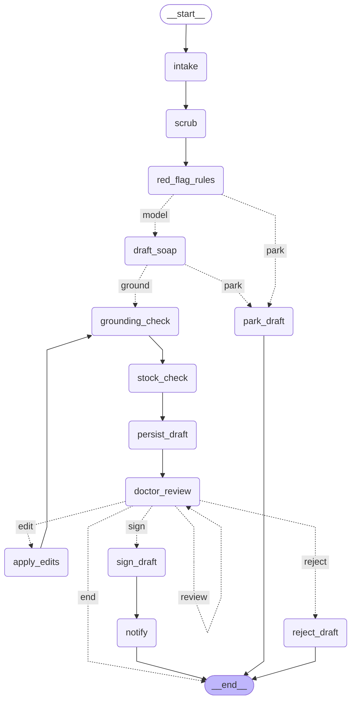

# Generated from the compiled graph by tools/export_graphs.py — do not hand-edit

```mermaid
---
config:
  flowchart:
    curve: linear
---
graph TD;
	__start__([<p>__start__</p>]):::first
	intake(intake)
	scrub(scrub)
	red_flag_rules(red_flag_rules)
	draft_soap(draft_soap)
	grounding_check(grounding_check)
	stock_check(stock_check)
	persist_draft(persist_draft)
	park_draft(park_draft)
	doctor_review(doctor_review)
	apply_edits(apply_edits)
	reject_draft(reject_draft)
	sign_draft(sign_draft)
	notify(notify)
	__end__([<p>__end__</p>]):::last
	__start__ --> intake;
	apply_edits --> grounding_check;
	doctor_review -. &nbsp;end&nbsp; .-> __end__;
	doctor_review -. &nbsp;edit&nbsp; .-> apply_edits;
	doctor_review -. &nbsp;reject&nbsp; .-> reject_draft;
	doctor_review -. &nbsp;sign&nbsp; .-> sign_draft;
	draft_soap -. &nbsp;ground&nbsp; .-> grounding_check;
	draft_soap -. &nbsp;park&nbsp; .-> park_draft;
	grounding_check --> stock_check;
	intake --> scrub;
	persist_draft --> doctor_review;
	red_flag_rules -. &nbsp;model&nbsp; .-> draft_soap;
	red_flag_rules -. &nbsp;park&nbsp; .-> park_draft;
	scrub --> red_flag_rules;
	sign_draft --> notify;
	stock_check --> persist_draft;
	notify --> __end__;
	park_draft --> __end__;
	reject_draft --> __end__;
	doctor_review -. &nbsp;review&nbsp; .-> doctor_review;
	classDef default fill:#f2f0ff,line-height:1.2
	classDef first fill-opacity:0
	classDef last fill:#bfb6fc

```
